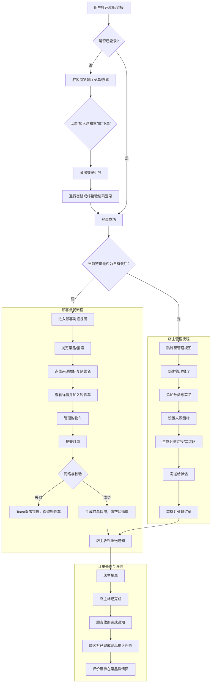
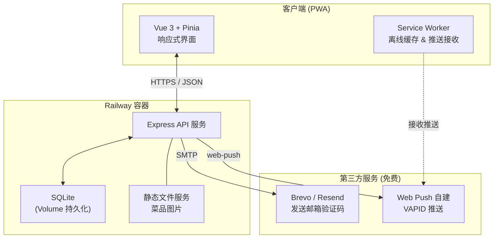

# 恋上菜单（Love Menu）项目综合文档

> **版本**：V1.0  
> **项目定位**：一个仅供数十人使用的情侣电子菜单 Web 应用，彻底脱离微信生态，以“免费、简单、可行”为最高原则。  
> **文档内容**：整合需求分析、功能设计、信息架构、交互细节、技术方案，作为开发与交付的最终基线。

---

## 目录

1. [产品概述](#1-产品概述)  
   1.1 [项目背景](#11-项目背景)  
   1.2 [目标用户](#12-目标用户)  
   1.3 [核心价值](#13-核心价值)  
2. [功能需求](#2-功能需求)  
   2.1 [角色与登录](#21-角色与登录)  
   2.2 [店主功能](#22-店主功能)  
   2.3 [顾客功能](#23-顾客功能)  
   2.4 [通用功能](#24-通用功能)  
   2.5 [明确不做的功能](#25-明确不做的功能)  
3. [信息架构](#3-信息架构)  
   3.1 [页面层级关系](#31-页面层级关系)  
   3.2 [导航结构](#32-导航结构)  
4. [交互设计与边缘情况](#4-交互设计与边缘情况)  
   4.1 [核心任务流程图](#41-核心任务流程图)  
   4.2 [页面交互细节](#42-页面交互细节)  
   4.3 [边缘情况处理矩阵](#43-边缘情况处理矩阵)  
5. [技术方案](#5-技术方案)  
   5.1 [技术栈选型](#51-技术栈选型)  
   5.2 [数据模型](#52-数据模型)  
   5.3 [API 设计](#53-api-设计)  
   5.4 [系统架构图](#54-系统架构图)  
   5.5 [第三方集成](#55-第三方集成)  
6. [部署与运行](#6-部署与运行)  
   6.1 [部署平台](#61-部署平台)  
   6.2 [环境配置](#62-环境配置)  
   6.3 [分发与测试](#63-分发与测试)  
7. [附录：关键决策记录](#7-附录关键决策记录)

---

## 1. 产品概述

### 1.1 项目背景

情侣在日常相处中频繁面临“吃什么”的决策问题，将这一日常场景包装成模拟餐厅的电子菜单，可通过角色扮演（一人担任“店主”备菜，另一人作为“顾客”点餐）创造专属的仪式感和趣味互动。市面上已有同类微信小程序（如食遇日记、好大一颗菜等），但本项目选择完全脱离微信生态，构建一个独立的轻量 Web 应用，仅供开发者及其亲密圈子（两位数用户）使用，追求零成本、高可控。

### 1.2 目标用户

- 年轻情侣（18–30 岁），双方乐于尝试轻互动形式增加生活情趣。
- 其中一方愿意花时间为对方定制“专属菜单”（店主角色）。
- 另一方享受浏览菜单、像进入餐厅一样点单的过程（顾客角色）。
- 使用场景以安卓手机浏览器为主，同时兼容 iPad 和 Windows 桌面浏览器。

### 1.3 核心价值

- **决策趣味化**：将“不知道吃什么”转化为一场专属点餐体验。
- **情感连接**：通过自定义菜单、食客等级等细节营造情侣间的温馨感。
- **零门槛分享**：一条链接即可触达，无需安装、无需注册微信生态。
- **极简且免费**：所有技术选型均使用免费开源方案，运维成本接近于零。

---

## 2. 功能需求

以下功能采用自然语言描述各模块的能力，已排除所有非必要特性。

### 2.1 角色与登录

- **通行密钥主登录**：利用设备指纹/面部识别一键登录，初次使用时自动创建账户。
- **邮箱验证码兜底登录**：当设备不支持通行密钥时，使用邮箱收取 6 位验证码完成登录。同一邮箱发送频率和每日次数受限制。
- **游客浏览**：未登录状态下可查看任意餐厅的菜单、搜索菜品；但点击“加入购物车”或“下单”时必须引导登录。
- **身份自动判定**：用户打开自己创建的餐厅链接时，直接跳转到管理后台；打开他人链接则进入顾客浏览模式。
- **设备绑定与切换**：在新设备上用邮箱登录后，系统识别已有账户并提示绑定新设备，可另行注册通行密钥。
- **账户注销**：支持完全删除账户。顾客注销后其历史订单删除；店主注销后其餐厅及菜品对外显示“已下线”，但关联订单快照保留。

### 2.2 店主功能

- **餐厅管理**：
  - 创建、修改、删除餐厅（名称、头像、简介）。
  - 删除餐厅为软删除，分享链接打开时显示“该餐厅已下线”，历史订单保留快照。
- **菜品分类**：自定义分类名称、排序，分类下有菜品时不可删除。
- **菜品维护**：
  - 添加菜品：名称（必填）、图片（拍照/相册，自动压缩至 ≤300KB）、描述、展示价格（选填）、勾选来源平台。
  - 来源平台：内置美团、美团外卖、京东到家、京东、抖音、淘宝图标，支持多选并自定义来源。
  - 编辑/删除菜品：删除为软删除，已下单的快照仍可显示。
  - 菜品被点次数自动统计。
- **订单处理**：
  - 查看待处理、已完成订单列表。
  - 操作“接单”“标记完成”，状态变更后顾客端通过推送通知。
  - 订单无超时自动取消，长期停滞保持原状态。
- **食客等级自定义**：
  - 店主可为餐厅设置多级趣味称号（如“心动初尝”“灵魂味蕾伴侣”），并指定每级所需的最低下单次数。
  - 系统根据顾客在本店的累计下单次数自动展示对应等级。
- **菜单分享**：生成专属链接与二维码，可复制或保存后通过任意通讯工具发送。

### 2.3 顾客功能

- **菜单浏览**：通过链接/二维码进入餐厅，按分类查看菜品卡片（含来源图标），支持按菜品名称实时搜索。
- **来源图标交互**：点击任何来源图标，直接将菜品名称复制到剪贴板，并给出 Toast 提示，不进行任何外部跳转。
- **购物车与下单**：
  - 添加菜品至购物车，可修改数量、删除单品。
  - 提交订单时系统生成不可变的订单菜品快照（菜名、价格、来源）。
  - 包含短时重复提交拦截与频率限制；若断网则保留购物车内容并提示。
  - 下单时若某菜品已被店主删除，后端校验后返回错误，购物车自动移除该无效项。
- **订单跟踪**：可查看“已提交→已接单→已完成”状态，状态变更伴随推送通知。
- **菜品评价**：仅已完成订单中的菜品可进行文字评价（限 200 字），评价内容公开展示在菜品详情页。

### 2.4 通用功能

- **推送通知**：基于 Web Push API 实现，订单状态变化时向相关用户发送摘要通知，不依赖任何第三方推送平台。
- **消息中心**：聚合展示“我收到的订单”（店主）和“我提交的订单”（顾客），支持按类型筛选。
- **响应式与 PWA**：适配安卓手机、iPad、Windows Chrome/Edge 等多种屏幕，可添加到设备主屏幕，支持离线浏览缓存静态资源。

### 2.5 明确不做的功能

- 真实支付、外部 App 跳转、订单超时自动取消。
- 菜品评分、评论区社交、用户关注系统。
- 优惠券、积分、会员等计价逻辑。
- 多语言、无障碍、数据导出、批量管理。
- 暂时不考虑验证码暴力破解防护、不接入各手机厂商推送通道。

---

## 3. 信息架构

### 3.1 页面层级关系

应用采用底部三标签导航作为顶级容器，各模块页面树如下：

```
应用外壳（PWA）
├── 登录/注册页
│   ├── 通行密钥登录
│   └── 邮箱验证码登录
├── 我的厨房（店主空间）
│   ├── 餐厅列表
│   │   ├── 创建餐厅模态框
│   │   └── 餐厅管理后台
│   │       ├── 菜品标签页
│   │       │   ├── 分类横向标签栏 / 管理分类页
│   │       │   ├── 菜品卡片列表
│   │       │   │   ├── 菜品添加/编辑页
│   │       │   │   └── 菜品详情页（含来源图标交互）
│   │       │   └── 菜品搜索（分类下本地筛选）
│   │       ├── 订单标签页
│   │       │   ├── 待处理 / 已完成订单列表
│   │       │   └── 订单详情（含操作按钮）
│   │       └── 设置标签页
│   │           ├── 餐厅信息编辑
│   │           ├── 食客等级设置
│   │           ├── 分享餐厅（链接/二维码）
│   │           └── 删除餐厅
├── 逛菜单（顾客空间）
│   ├── 输入链接 / 扫码入口
│   ├── 餐厅主页（他人店铺）
│   │   ├── 菜品分类与搜索
│   │   ├── 菜品详情（含来源图标、评价展示）
│   │   └── 购物车悬浮球
│   │       ├── 购物车列表
│   │       └── 订单确认提交
│   ├── 我的订单（顾客视角）
│   │   ├── 已提交 / 已接单 / 已完成列表
│   │   └── 订单详情（含菜品评价入口）
│   └── 最近访问记录
├── 消息
│   ├── 我收到的订单（店主角筛选）
│   └── 我提交的订单（顾客角筛选）
└── 用户设置
    ├── 个人资料（昵称/头像/绑定邮箱）
    ├── 通行密钥管理
    └── 注销账户
```

### 3.2 导航结构

- **底部导航栏（固定）**
  - 🍳 **我的厨房**：进入店主管理空间，查看自有餐厅列表。
  - 🔍 **逛菜单**：进入顾客浏览空间，输入链接/扫码访问他人餐厅。
  - 🔔 **消息**：聚合所有订单相关通知，标签切换“收/发”。
- **顶部导航**：餐厅管理后台内部使用横向标签切换“菜品/订单/设置”。
- **返回与跳转**：
  - 从“逛菜单”访问他人餐厅时，采用路由栈自然返回至“逛菜单”首页。
  - 设置页入口：“我的厨房”右上角头像或个人中心图标。

---

## 4. 交互设计与边缘情况

### 4.1 核心任务流程图

以下 Mermaid 图覆盖从登录到下单评价的完整流程，包含游客路径、身份跳转和主要异常处理。



### 4.2 页面交互细节

以下是关键页面的状态描述，所有页面均严格覆盖：**初始状态、操作触发、成功/失败反馈、空状态、加载态**。

#### 4.2.1 登录页
- **初始**：Logo + “通行密钥登录”（主按钮）与“邮箱验证码登录”（次按钮）。
- **通行密钥**：调用浏览器原生认证面板，通过则直接进入首页；失败或不支持则提示回退邮箱登录。
- **邮箱登录**：输入邮箱后获取验证码，按钮倒计时 60 秒；验证码错误边框变红，过期提示重新获取。连续 5 次错误当日禁止该邮箱。
- **空状态**：不适用。
- **退出**：切换方式时输入内容不保留。

#### 4.2.2 我的厨房（餐厅列表）
- **空状态**：插画 + “还没有餐厅，开一家吧” + 创建按钮。
- **创建餐厅**：模态框输入名称、头像、简介；名称为空时标红提示；网络错误时对话框保留，顶部提示“网络错误”。
- **删除餐厅**：左滑或菜单选择删除，二次确认后卡片消失，Toast 提示完成。

#### 4.2.3 餐厅管理后台 - 菜品
- **空状态**：空盘子插画 + “还没有菜品，点击右下角 + 添加”。
- **添加菜品**：悬浮“+”按钮进入表单页，图片上传区可重传/删除；名称为空阻止保存；图片上传中保存按钮短暂置灰。
- **编辑/删除**：菜品卡片点击进入编辑页；删除时确认弹窗。
- **来源图标**：任何页面的图标点击均复制菜名，Toast 显示“已复制「菜名」”。
- **加载态**：菜品列表使用骨架屏。

#### 4.2.4 购物车
- **初始**：从悬浮球进入，展示购物车列表和合计。
- **数量调整**：加减按钮或手动输入，减至 0 自动移除。
- **提交订单**：空购物车按钮置灰；成功后清空购物车并跳转；网络错误保留购物车并提示；频率限制或重复提交拦截并提示。
- **空状态**：空购物车插画 + “去逛逛吧”按钮。

#### 4.2.5 消息中心
- **筛选切换**：“我收到的订单”与“我提交的订单”两个视图，点击通知卡片跳转对应订单详情。
- **空状态**：各筛选下无数据时显示“暂无消息”。

### 4.3 边缘情况处理矩阵

| 边缘情况 | 处理策略 |
|-----------|----------|
| 用户快速连续点击保存/提交 | 按钮点击后立即置灰，0.5 秒内不响应二次点击 |
| 任意网络请求失败 | 统一 Toast “网络错误，请检查连接后重试”，不关闭页面，表单数据保留 |
| 数据列表为空 | 所有列表页使用插图 + 文案空状态，不显示空白页 |
| 图片上传失败 | 上传区显示红色感叹号，可点击重试，不影响其他字段 |
| 用户未保存中途退出 | 关键表单页在离开前通过 `beforeunload` 弹出提示 |
| 通行密钥创建失败 | 提示设备不支持或取消，自动回退邮箱登录表单 |
| 验证码连续错误 | 5 次错误后当日禁止该邮箱获取验证码 |
| 打开已删除餐厅链接 | 展示“该餐厅已下线”提示 |
| 下单时菜品已被店主删除 | 后端校验后返回部分菜品无效，提示并从购物车中移除 |
| 店主注销后订单查询 | 订单快照保留，餐厅信息显示“已下线” |
| 浏览器不支持 WebAuthn | 隐藏通行密钥按钮，仅显示邮箱登录 |
| 多标签页购物车 | 以最后操作为准，不做跨标签同步（已知限制） |

---

## 5. 技术方案

### 5.1 技术栈选型

| 层次 | 技术选型 | 说明 |
|------|---------|------|
| 前端框架 | Vue 3 + Vite | 轻量、响应式，PWA 插件支持良好 |
| UI 样式 | TailwindCSS | 原子化 CSS，快速适配多端 |
| 状态管理 | Pinia | Vue 3 官方推荐 |
| 路由 | Vue Router 4 | 支持动态参数路由（餐厅 ID） |
| 后端框架 | Node.js + Express | 简单通用，开发效率高 |
| ORM | Drizzle ORM | TypeScript 优先，Schema 即文档 |
| 数据库 | SQLite | 单文件零配置，满足两位数需求 |
| 认证 | @simplewebauthn/server + browser | 通行密钥标准实现 |
| 邮件 | Brevo / Resend | 免费层级，SMTP 或 API 发送 |
| 推送 | Web Push API + web-push 库 | 自建 VAPID，零成本零依赖 |
| 图片存储 | 本地磁盘（Express 静态文件） | 前端压缩，后端直接读取 |
| PWA | vite-plugin-pwa | 自动生成 manifest 与 Service Worker |
| 部署 | Railway | 免费层级，自动 HTTPS，Volume 持久化 |

### 5.2 数据模型

使用 Drizzle ORM 的 SQLite 方言定义，满足项目所需的所有快照、软删除、食客等级、来源等需求。

```typescript
// 用户
users: { id, email (unique), nickname, avatar_url, created_at }

// 通行密钥凭据
credentials: { id, user_id (FK), public_key, counter, device_name, created_at }

// 餐厅（软删除：is_deleted）
restaurants: { id, owner_id (FK), name, avatar_url, intro, is_deleted, created_at }

// 菜品分类
categories: { id, restaurant_id (FK), name, sort_order, created_at }

// 菜品（软删除：is_deleted）
dishes: { id, restaurant_id (FK), category_id (FK nullable), name, image_url,
          description, price, sources (JSON), is_deleted, order_count, created_at }

// 食客等级
guest_levels: { id, restaurant_id (FK), title, min_orders, sort_order }

// 购物车
carts: { id, user_id (FK), restaurant_id (FK), created_at }
cart_items: { id, cart_id (FK), dish_id (FK), quantity }

// 订单（快照时间：snapshot_at）
orders: { id, customer_id (FK), restaurant_id (FK), status, total_price, snapshot_at, created_at }
order_items: { id, order_id (FK), dish_name, dish_price, dish_sources, dish_image,
               quantity, is_reviewed, original_dish_id }

// 菜品评价
reviews: { id, order_item_id (FK unique), user_id (FK), content, created_at }
```

**关键设计**：
- `order_items` 的菜名、价格、来源独立存储，不依赖 `dishes` 表外键，形成订单快照。
- 餐厅、菜品采用软删除，账户注销后订单快照保留。
- 食客等级至少保留一条记录。

### 5.3 API 设计

基础路径 `/v1`，JWT 认证，游客可访问 GET 菜单接口。

| 模块 | 端点举例 | 对应功能 |
|------|---------|---------|
| 认证 | `POST /auth/webauthn/register/*`、`POST /auth/email/*` | 通行密钥与邮箱登录 |
| 餐厅 | `POST /restaurants`、`GET /restaurants/mine`、`GET /restaurants/:id/share` | 创建、列表、分享 |
| 菜品 | `CRUD /restaurants/:id/dishes`、`GET ...?search=` | 增删改查、搜索 |
| 分类 | `CRUD /restaurants/:id/categories` | 分类管理 |
| 购物车 | `GET /cart`、`POST /cart/items`、`PUT/DELETE /cart/items/:id` | 购物车操作 |
| 订单 | `POST /orders`（带快照）、`GET /orders/mine`、`PUT /orders/:id/accept` | 下单与状态流转 |
| 评价 | `POST /orders/:oid/items/:iid/review` | 文字评价 |
| 食客等级 | `GET/PUT /restaurants/:id/guest-levels` | 等级查看与编辑 |
| 推送 | `POST /push/subscribe`、`DELETE /push/unsubscribe` | 推送订阅管理 |

关键状态处理：
- 下单时后端校验购物车内菜品是否已下架，若已下架则返回错误并从购物车移除。
- 防重与限流：所有写操作前端防抖 + 后端幂等校验。
- 验证码限制：同邮箱 1 分钟 1 发，每日上限，连续错误 5 次锁定当日。

### 5.4 系统架构图



### 5.5 第三方集成

| 服务 | 用途 | 免费额度 | 接入方式 | 备注 |
|------|------|----------|----------|------|
| Brevo / Resend | 邮箱验证码 | 100~300 封/天 | SMTP 或 REST API | 每日用量远低于限额 |
| Web Push (VAPID) | 订单状态推送 | 无限 | `web-push` npm 包 | 一行命令生成密钥对 |
| 本地磁盘 | 菜品图片 | Railway Volume 1GB | Express 静态文件 | 前端压缩至 ≤300KB |
| Railway Volume | SQLite 持久化 | 含于免费额度 | 挂载 `/data` 目录 | 防止容器重启丢失 |

**集成决策**：
- 通行密钥利用 iCloud/Google 密码管理器实现自然跨设备，不开发 caBLE。
- 浏览器不支持 WebAuthn 时完全隐藏通行密钥入口。
- 桌面端无凭据提示用已绑定手机扫码或邮箱登录。

---

## 6. 部署与运行

### 6.1 部署平台

**Railway**  
- 免费层级每月 5 美元信用额度，对于两位数用户完全免费。
- 支持从 GitHub 仓库自动部署，代码推送触发构建。
- 自动提供 HTTPS 证书，无需手动管理。
- 通过 Volume（免费 1GB）挂载 `/data` 目录持久化 SQLite 和上传图片。

**前端可选分离托管**  
- 若需极低延迟加载静态资源，可将前端构建产物部署至 **Vercel** 免费层（自定义域名），后端 API 仍在 Railway。

### 6.2 环境配置

项目根目录 `.env` 变量：

```env
DATABASE_PATH=/data/lovemenu.db
JWT_SECRET=<随机64位字符串>
VAPID_PUBLIC_KEY=<web-push 生成>
VAPID_PRIVATE_KEY=<web-push 生成>
SMTP_HOST=smtp.brevo.com
SMTP_PORT=587
SMTP_USER=<Brevo 账户邮箱>
SMTP_PASS=<Brevo SMTP Key>
CORS_ORIGIN=https://your-frontend-domain.vercel.app
```

### 6.3 分发与测试

- **测试分发**：使用 **ngrok** 等免费隧道工具将本地后端暴露公网，供朋友通过手机浏览器直接访问前端页面。
- **生产分发**：PWA 特性允许用户将站点“添加至主屏幕”，无需通过应用商店。分享餐厅功能也只需复制链接/二维码。
- **域名与安全**：Railway 提供自动 HTTPS 和 `*.up.railway.app` 子域名，也可绑定自定义域名（免费）。

---

## 7. 附录：关键决策记录

| 决策项 | 选项 | 最终选择 | 理由 |
|--------|------|----------|------|
| 登录方式 | 手机号 / 邮箱 / 通行密钥 | 通行密钥 + 邮箱兜底 | 零短信成本，通行密钥体验最佳且免费 |
| 菜品来源跳转 | 深链接唤端 / 仅复制菜名 | **仅复制菜名** | 避免平台限制与维护成本 |
| 推送方案 | FCM / 自建 VAPID | **自建 VAPID** | 无第三方依赖，完全免费 |
| 数据库 | PostgreSQL / SQLite | **SQLite** | 两位用户无需完整 RDBMS，零部署成本 |
| 图片存储 | S3 / 本地磁盘 | **本地磁盘** | 用量极小，无需 CDN，完全免费 |
| 跨设备认证 | caBLE / 云同步 + 邮箱 | **云同步 + 邮箱兜底** | 实现简单，覆盖主流用户 |
| 部署平台 | Railway / Render | **Railway** | 免费额度充裕，不冻眠 |

---

*本文档整合了从需求到实施的完整路径，可作为开发、协作与交付的唯一参考。*